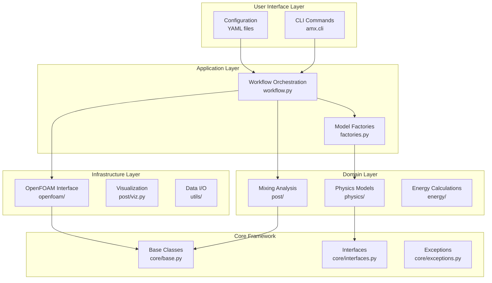
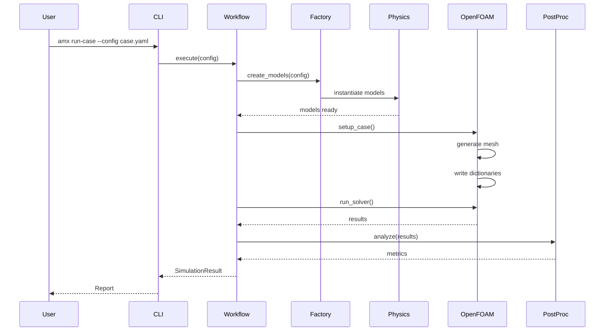

# System Architecture

## Overview

The Anaerobic Mixing OpenFOAM (AMX) framework follows a **layered architecture** with clean separation of concerns, utilizing design patterns for flexibility and maintainability.



## Core Components

### 1. Core Framework (`src/amx/core/`)

The foundation layer providing abstract base classes and interfaces:

| File | Purpose | Key Classes |
|------|---------|-------------|
| `base.py` | Abstract base classes | `BaseModel`, `BaseSimulation`, `BaseAnalyzer`, `SimulationResult` |
| `interfaces.py` | Model interfaces | `FluidModel`, `TurbulenceModel`, `RheologyModel`, `MixingModel` |
| `exceptions.py` | Exception hierarchy | `AMXError`, `ConfigurationError`, `SimulationError`, `AnalysisError` |

### 2. Physics Models (`src/amx/physics/`)

Domain-specific physics implementations:

| File | Purpose | Models |
|------|---------|--------|
| `models.py` | Unified physics models | `NewtonianFluid`, `NonNewtonianFluid`, `StandardKEpsilon`, `ComprehensiveMixingModel` |
| `sludge_rheology.py` | Sludge rheology | `SludgeProperties`, `TemperatureEffects`, `MixingRegimeAnalysis` |
| `jet_model.py` | Jet dynamics | `JetModel`, `JetArray` |
| `mixing_theory.py` | Mixing theory | `MixingTheory`, `CampNumber` |
| `turbulence.py` | Turbulence models | `RANS_kEpsilon` (legacy, refactored to models.py) |

### 3. OpenFOAM Interface (`src/amx/openfoam/`)

Bridge between Python and OpenFOAM:

| File | Purpose | Functionality |
|------|---------|---------------|
| `fvoptions.py` | Momentum sources | `FvOptionsWriter` - Generates fvOptions with Gaussian jet distribution |
| `writer.py` | Dictionary writer | `DictWriter` - Template-based OpenFOAM dictionary generation |
| `meshing.py` | Mesh generation | `MeshGenerator` - Industrial-grade mesh (5-7M cells) |
| `runner.py` | Solver execution | `CaseRunner` - Robust solver execution with monitoring |
| `sampling.py` | Data sampling | Field sampling and probe setup |

### 4. Post-Processing (`src/amx/post/`)

Analysis and visualization:

| File | Purpose | Capabilities |
|------|---------|--------------|
| `advanced_metrics.py` | Industrial metrics | `MixingMetricsAdvanced` - Dead zones, RTD, energy uniformity |
| `metrics.py` | Basic metrics | Standard mixing performance calculations |
| `viz.py` | Visualization | `Visualizer` - 3D rendering with PyVista |
| `fields.py` | Field processing | VTK field data extraction |
| `io.py` | Data I/O | Result file handling |

### 5. Factory Layer (`src/amx/factories.py`)

Model creation and dependency injection:

```python
ModelFactory
├── FluidFactory
│   ├── create() -> FluidModel
│   └── from_config() -> FluidModel
├── TurbulenceFactory
│   ├── create() -> TurbulenceModel
│   └── from_config() -> TurbulenceModel
└── MixingFactory
    ├── create() -> MixingModel
    └── from_config() -> MixingModel
```

## Design Patterns

### 1. **Factory Pattern**
- Centralized model creation
- Configuration-driven instantiation
- Extensible for new model types

### 2. **Strategy Pattern**
- Multiple rheology models (Newtonian, Power-law, Herschel-Bulkley)
- Switchable turbulence models
- Configurable mixing correlations

### 3. **Template Method Pattern**
- `BaseSimulation` defines workflow skeleton
- Concrete implementations override specific steps
- Consistent execution flow

### 4. **Dependency Injection**
- Models receive dependencies through constructors
- Factories manage dependency creation
- Loose coupling between components

## Data Flow



## Configuration Architecture

### Configuration Hierarchy

```yaml
project: "digester_simulation"
├── paths:           # File system paths
├── geometry:        # Physical geometry
│   ├── tank:       # Tank dimensions
│   ├── nozzle:     # Jet configuration
│   └── screen:     # Porous zones
├── fluid:          # Fluid properties
│   ├── type:       # water/sludge/custom
│   └── properties: # Physical properties
├── operation:      # Operating conditions
├── solver:         # OpenFOAM solver settings
├── turbulence:     # Turbulence model
├── export:         # Output configuration
└── targets:        # Performance targets
```

## Extension Points

### Adding New Fluid Models

1. Implement `FluidModel` interface in `physics/models.py`
2. Register in `FluidFactory._models`
3. Update configuration schema

### Adding New Turbulence Models

1. Implement `TurbulenceModel` interface
2. Add to `TurbulenceFactory._models`
3. Update model selection logic

### Adding New Analysis Metrics

1. Extend `BaseAnalyzer` in `core/base.py`
2. Implement analysis logic
3. Register in workflow pipeline

## Performance Considerations

### Memory Management
- Lazy loading of large datasets
- Streaming processing for field data
- Efficient numpy operations

### Parallel Processing
- OpenFOAM MPI support
- Parallel post-processing capability
- Batch analysis operations

### Caching Strategy
- Model instance caching in factories
- Result caching in analyzers
- Configuration validation caching

## Error Handling Strategy

```python
AMXError (Base)
├── ConfigurationError    # Invalid configuration
├── SimulationError      # Simulation failures
│   ├── ConvergenceError # Solver convergence
│   └── MeshError       # Mesh generation
├── AnalysisError       # Post-processing errors
├── ValidationError     # Data validation
└── IOError            # File I/O issues
```

## Testing Architecture

```
tests/
├── unit/              # Unit tests
│   ├── test_models.py
│   ├── test_factories.py
│   └── test_metrics.py
├── integration/       # Integration tests
│   ├── test_workflow.py
│   └── test_openfoam.py
└── fixtures/         # Test data
    ├── configs/
    └── results/
```

## Deployment Architecture

### Docker Container
```dockerfile
Base Image: OpenFOAM v11
Python Environment: 3.11+
Dependencies: requirements.txt
Entry Point: amx CLI
```

### HPC Deployment
```
Singularity/Apptainer
MPI Support
SLURM Integration
Parallel Execution
```

## Security Considerations

1. **Input Validation**: Pydantic models validate all inputs
2. **Path Traversal**: Absolute path validation
3. **Command Injection**: Parameterized OpenFOAM commands
4. **Resource Limits**: Memory and CPU constraints
5. **File Permissions**: Restricted write access