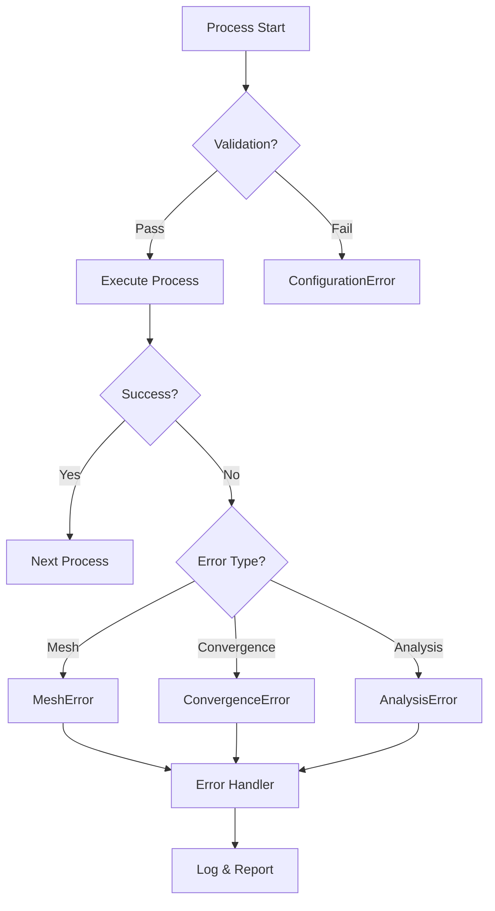

# Process Flow Documentation

## Complete Simulation Pipeline

This document details every process in the simulation workflow and the files involved at each stage.

## 🔄 Main Process Flow


---

## 📋 Process 1: Configuration Loading

**Purpose**: Load and validate simulation parameters

### Files Involved:
| File | Role | Input/Output |
|------|------|--------------|
| `configs/case_prod.yaml` | Configuration source | Input: User parameters |
| `src/amx/config.py` | Configuration validation | Process: Pydantic validation |
| `src/amx/cli.py` | Command-line interface | Input: CLI arguments |

### Process Steps:
```python
1. User runs: amx run-case --config configs/case_prod.yaml
2. CLI loads YAML → config.load_config()
3. Pydantic validates → Config model
4. Returns validated configuration object
```

### Key Parameters:
- Geometry: Tank (20×8×16m), 32 nozzles
- Fluid: Sludge (ρ=1015 kg/m³, μ=0.0035 Pa·s)
- Operation: 430 m³/h flow rate, 15m head
- Solver: pimpleFoam, 30 min simulation

---

## 🏭 Process 2: Model Factory Creation

**Purpose**: Instantiate physics models based on configuration

### Files Involved:
| File | Role | Models Created |
|------|------|----------------|
| `src/amx/factories.py` | Factory orchestration | `ModelFactory` |
| `src/amx/physics/models.py` | Model implementations | `NonNewtonianFluid`, `StandardKEpsilon` |
| `src/amx/physics/sludge_rheology.py` | Rheology calculations | `SludgeProperties` |

### Process Flow:
```python
# Model creation pipeline
ModelFactory(config)
├── FluidFactory.create()
│   └── NonNewtonianFluid(TS=3.5%, T=308K)
│       └── Herschel-Bulkley parameters
├── TurbulenceFactory.create()
│   └── StandardKEpsilon(nu=3.45e-6)
└── MixingFactory.create()
    └── ComprehensiveMixingModel(fluid)
```

### Calculations Performed:
1. **Fluid Properties**:
   - Density: ρ = ρ_water × (1 + 0.0075 × TS)
   - Yield stress: τ₀ = exp(-3.2 + 0.75 × TS^0.8)
   - Consistency: K = 0.05 × TS^1.5

2. **Turbulence Parameters**:
   - k_init = 1.5 × (U × I)²
   - ε_init = C_μ^(3/4) × k^(3/2) / l

---

## 🔧 Process 3: OpenFOAM Case Setup

**Purpose**: Create OpenFOAM case structure and dictionaries

### Files Involved:
| File | Role | Generated Files |
|------|------|-----------------|
| `src/amx/workflow.py` | Orchestration | Controls flow |
| `src/amx/openfoam/writer.py` | Dictionary generation | `controlDict`, `fvSchemes`, `fvSolution` |
| `src/amx/openfoam/fvoptions.py` | Momentum sources | `constant/fvOptions` |
| `case_templates/*` | Templates | Base dictionary files |

### Generated Structure:
```
runs/prod/case/
├── 0/                    # Initial conditions
│   ├── U                # Velocity field
│   ├── p_rgh           # Pressure
│   ├── k               # Turbulent kinetic energy
│   ├── epsilon         # Dissipation rate
│   └── nut             # Eddy viscosity
├── constant/           # Physical properties
│   ├── fvOptions       # Momentum sources (32 jets)
│   ├── transportProperties
│   └── turbulenceProperties
└── system/            # Numerical settings
    ├── controlDict
    ├── fvSchemes
    └── fvSolution
```

### Momentum Source Calculation:
```cpp
// For each nozzle (32 total)
momentumFlux = ρ × Q × V_jet
// Q = 430/32/3600 = 0.00373 m³/s per nozzle
// V_jet = Q/A = 3.9 m/s
// Gaussian distribution in space
weight = exp(-(r/σ)²)
```

---

## 🔲 Process 4: Mesh Generation

**Purpose**: Create computational mesh with refinement zones

### Files Involved:
| File | Role | Function |
|------|------|----------|
| `src/amx/openfoam/meshing.py` | Mesh control | `MeshGenerator` class |
| `system/blockMeshDict` | Mesh definition | Block structure |
| `system/snappyHexMeshDict` | Refinement | Local refinement zones |

### Mesh Specifications:
```yaml
Base mesh: 200 × 80 × 160 = 2.56M cells
Refinement zones:
  - Nozzle region (0-4m height): Level 2 → 4× refinement
  - Jet development (r=6m): Level 1 → 2× refinement  
  - Free surface (14-16m): Level 1 → 2× refinement
Total cells: ~5-7M cells
Cell quality:
  - y+ target: 30 (wall functions)
  - Max aspect ratio: 10
  - Max skewness: 0.5
```

### Process Commands:
```bash
1. blockMesh          # Create base mesh
2. snappyHexMesh     # Apply refinements
3. checkMesh         # Validate quality
```

---

## 🚀 Process 5: Solver Execution

**Purpose**: Run CFD simulation with pimpleFoam

### Files Involved:
| File | Role | Function |
|------|------|----------|
| `src/amx/openfoam/runner.py` | Solver control | `CaseRunner` class |
| `system/controlDict` | Time control | dt=0.05s, endTime=1800s |
| `system/fvSchemes` | Discretization | Second-order schemes |
| `system/fvSolution` | Linear solvers | GAMG for pressure |

### Solver Configuration:
```cpp
pimpleFoam settings:
  - Time step: 0.05s (adaptive)
  - Max Courant: 2.0
  - PIMPLE loops: 2
  - Pressure correctors: 2
  - Non-orthogonal correctors: 1
```

### Monitoring:
- Residuals: U, p, k, epsilon
- Continuity errors
- Courant number
- Force coefficients

---

## 📊 Process 6: Post-Processing

**Purpose**: Extract and analyze simulation results

### Files Involved:
| File | Role | Analysis Type |
|------|------|---------------|
| `src/amx/post/advanced_metrics.py` | Advanced analysis | `MixingMetricsAdvanced` |
| `src/amx/post/metrics.py` | Basic metrics | Velocity, mixing time |
| `src/amx/post/fields.py` | Field extraction | VTK processing |
| `src/amx/post/viz.py` | Visualization | 3D rendering |

### Metrics Calculated:

#### 6.1 Velocity Analysis
```python
# Files: advanced_metrics.py → calculate_velocity_statistics()
- Mean velocity (volume-weighted)
- RMS velocity
- Coefficient of variation
- Shear rate distribution
```

#### 6.2 Dead Zone Analysis
```python
# Files: advanced_metrics.py → calculate_dead_zones()
- Dead zone fraction (U < 0.05 m/s)
- Stagnant zones (U < 0.01 m/s)
- Largest connected dead zone
- Active mixing volume
```

#### 6.3 Energy Metrics
```python
# Files: advanced_metrics.py → calculate_energy_metrics()
- Dissipation rate (ε)
- Velocity gradient (G-value)
- Power density (W/m³)
- Energy uniformity index
```

#### 6.4 Mixing Time
```python
# Files: mixing_theory.py + advanced_metrics.py
- Circulation time: t_c = L/U_mean
- Mixing time: t_mix = 4 × t_c
- Camp number: Gt
```

---

## 📈 Process 7: Analysis & Reporting

**Purpose**: Generate comprehensive performance reports

### Files Involved:
| File | Role | Output |
|------|------|--------|
| `src/amx/workflow.py` | Report orchestration | JSON metrics |
| `src/amx/post/advanced_metrics.py` | Report generation | Performance summary |
| `src/amx/energy/power.py` | Energy analysis | Power consumption |

### Report Structure:
```json
{
  "velocity_statistics": {
    "mean_velocity": 0.32,  // m/s
    "dead_zone_fraction": 0.08
  },
  "mixing_performance": {
    "mixing_time": 1680,  // seconds
    "camp_number": 84000
  },
  "energy_metrics": {
    "power_consumption": 45000,  // W
    "specific_power": 17.6  // W/m³
  },
  "validation": {
    "meets_velocity_target": true,
    "meets_deadzone_target": true
  }
}
```

---

## 🔀 Process Variations

### A. PIV Validation Process

**Files**: `src/amx/piv/processing.py`, `src/amx/piv/compare.py`


### B. Energy Optimization Process

**Files**: `src/amx/energy/power.py`


---

## 🗂️ File Categories by Process Stage

### Input Files (User-Provided)
- `configs/*.yaml` - Configuration files
- `data/raw/piv/*` - PIV experimental data

### Template Files (Static)
- `case_templates/0/*` - Initial condition templates
- `case_templates/constant/*` - Property templates
- `case_templates/system/*` - Solver setting templates

### Generated Files (Runtime)
- `runs/*/case/*` - OpenFOAM case files
- `runs/*/postProcessing/*` - Sampled data
- `data/processed/*` - Analysis results

### Output Files (Results)
- `*.json` - Metrics and analysis
- `*.vtk` - Visualization data
- `*.png` - Rendered images
- `*.md` - Reports

---

## 🔧 Process Control Files

### Main Orchestrator
- **`workflow.py`**: Controls entire simulation pipeline
  - Calls factories for model creation
  - Manages OpenFOAM interface
  - Coordinates post-processing
  - Generates reports

### Sub-Process Controllers
- **`runner.py`**: OpenFOAM solver execution
- **`meshing.py`**: Mesh generation control
- **`advanced_metrics.py`**: Analysis orchestration

---

## 📝 Configuration Impact on Processes

| Config Section | Affected Processes | Key Files |
|----------------|-------------------|-----------|
| `geometry` | Mesh, Momentum sources | `meshing.py`, `fvoptions.py` |
| `fluid` | Models, Transport | `models.py`, `sludge_rheology.py` |
| `operation` | Jets, Energy | `jet_model.py`, `power.py` |
| `solver` | Execution, Convergence | `runner.py`, `controlDict` |
| `turbulence` | Initial conditions | `models.py`, k/epsilon files |
| `export` | Post-processing | `fields.py`, `viz.py` |
| `targets` | Validation, Reports | `advanced_metrics.py` |

---

## 🚨 Error Handling Flow



---

## 📊 Performance Monitoring

### Key Performance Indicators (KPIs)
1. **Simulation Time**: ~2-3 hours for 30 min physical time
2. **Memory Usage**: ~8-12 GB for 5M cells
3. **Convergence**: Residuals < 1e-4
4. **Post-Processing**: ~5-10 min for full analysis

### Monitoring Points
- Pre-mesh: Validate configuration
- Post-mesh: Check cell quality
- During solve: Monitor residuals
- Post-solve: Verify conservation
- Post-analysis: Validate metrics